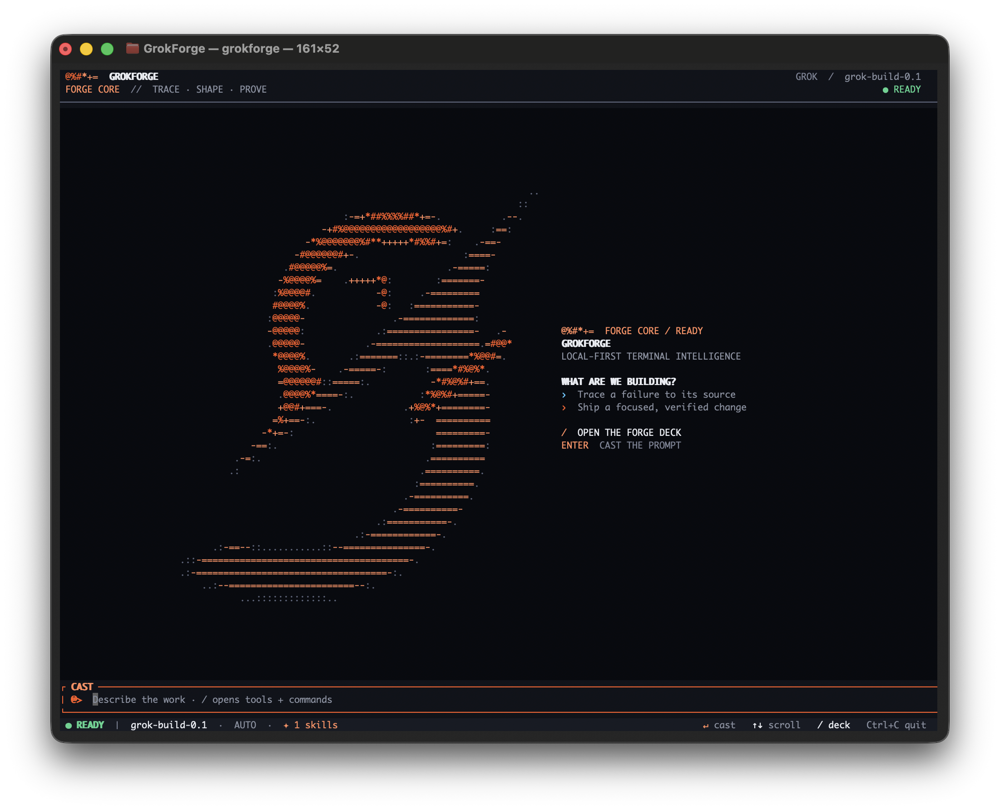

<div align="center">
  
  <h1>GrokForge</h1>
  <p><strong>Make Grok great in the terminal.</strong></p>
  
</div>

GrokForge exists because using Grok from a terminal should feel like a serious development tool, not a chat window wired to `sh`.

Today it can read and patch project files, inspect Git state, query local language servers, build a
bounded repository map, run commands, keep and manage sessions, use project-defined workflows and
tools, and hand isolated work to subagents that run in parallel. When an action needs to cross a
safety boundary, GrokForge stops and asks.

This is a pre-release project. The execution and safety paths are in place, and the adaptive TUI
exposes tool activity, approvals, questions, reasoning, retries, token use, and privacy accounting.
Automatic semantic context selection, richer rendering, and distribution still need work.

## Why I built GrokForge

> I believe I should know exactly what code is running on my own machine. Anything less is
> complete BS.
>
> — [XBToshi](https://x.com/XBToshi/status/2076521420017045618?s=20)

I built GrokForge because, for my work, I believe Grok 4.5 is the best model available right
now—and I love using it. [xAI built Grok 4.5](https://x.ai/news/grok-4-5) specifically for coding,
agentic tasks, and knowledge work. I wanted to give that model family a serious terminal
environment without turning my own machine or repository into a black box. The code that reads
files, runs commands, handles credentials, changes Git state, and sends context to a model should
be code I can inspect.

### Why GrokForge is different

GrokForge is better when control matters:

- **Audit the whole thing.** GrokForge is an MIT-licensed Rust workspace you can inspect,
  compile, modify, and run yourself. It has no telemetry.
- **Account for model requests.** Every first-party model request body goes through the context
  ledger, which attributes source bytes, records redactions, and reconciles them to the serialized
  request.
- **See what the agent is doing.** Tool activity, reasoning, approvals, retries, token use,
  subagents, request-byte totals, and redaction totals stay visible in the TUI.
- **Fail closed by default.** Normally sandboxed commands use Seatbelt on macOS or validated
  Bubblewrap on Linux, with workspace-confined writes, protected Git metadata, isolated networking,
  and a scrubbed environment. If the requested confinement cannot be enforced, the command does not
  run.
- **Choose every extra capability.** Hosted web search, X search, and code interpreter stay off
  until enabled. Project MCP servers and project executable tools do not load without separate,
  explicit trust flags.
- **Own your credentials.** API keys and OAuth tokens live in one documented, password-encrypted
  local file—not an opaque OS secret store. On native macOS and Linux, model-run commands cannot
  read it even in full-access mode.
- **Parallelize without sharing a workspace.** Up to 32 subagents can work concurrently in
  separate private Git worktrees with scoped, reviewable changes; GrokForge never silently merges
  them.
- **Keep workflows with the repository.** Skills and reusable slash commands live beside the code,
  and typing `/` opens the local Forge Deck without sending command templates to the model just for
  browsing them. Its tool row and `/tools` view are built from the exact tool registry loaded for
  that agent, including trusted custom and MCP tools.

## What works today

- An adaptive, branded native Rust TUI with streaming conversations and human-readable tool activity
- Headless runs for scripts and CI
- File read, write, edit, bounded single-file `apply_patch`, list, glob, and grep tools, plus safe
  read-only Git status and diff
- Sandboxed shell commands with approval controls
- Project skills in `.grokforge/skills/*/SKILL.md` and reusable slash commands in `.grokforge/commands/*.md`
- Language-neutral, hash-pinned custom executable tools from an owner manifest or an explicitly
  trusted project manifest, using a bounded JSON protocol and the normal sandbox/approval path
- Explicit opt-ins for Grok web search, X search, and code interpreter tools
- Approval-gated stdio and Streamable HTTP MCP tools from reviewed project configuration via
  `--trust-project-mcp`, pre-registered OAuth with encrypted tokens, plus stdio servers from
  validated ACP editor declarations
- Read-only plan turns plus model-callable, workspace-isolated `update_plan` and `read_plan` state
- Persistent sessions with list, full-transcript search, resume, export, fork, rename, and confirmed
  delete
- Parallel subagents (up to 32 per turn) in isolated worktrees with scoped commits, shown live in a "PARALLEL AGENTS" panel
- `@`-mention text/folder attachments, native bounded PNG/JPEG inputs, and agent-managed persistent
  memory (`.grokforge/memory/`)
- A bounded lexical `repo_map`, one-shot local LSP diagnostics/queries, and private-copy formatting
- Structured one-to-three-question prompts in the TUI, with bounded custom answers and FIFO
  handling across subagents
- Typed global/project configuration, startup model validation, and live `/model` + `/effort`
  controls
- Editor embedding over ACP (Agent Client Protocol) via `grokforge acp` — Zed and other ACP clients
- An authenticated loopback HTTP API via `grokforge serve`, with bounded SSE protocol events,
  durable session metadata, disconnect cancellation, a workspace single-writer gate, and a
  checked-in OpenAPI contract
- Generated shell completions for Bash, Zsh, Fish, Elvish, and PowerShell
- A context ledger that accounts for request bodies sent to Grok and configured remote MCP servers,
  with `/ledger` and `/status` in the TUI and a plain-text or `--ledger` export from `exec`
- Hidden `grokforge debug sandbox` and `debug repomap` diagnostics, plus a `doctor` report that
  includes code-intelligence, custom-tool, and MCP surfaces without starting them
- Secret redaction, bounded output, and no telemetry

## Build it

You need Rust 1.88 or newer.

```sh
git clone https://github.com/mahdi-salmanzade/GrokForge.git
cd GrokForge
cargo build --release
```

## Signing in

Just run it — GrokForge sets up credentials on the first interactive launch when
`XAI_API_KEY` is not already set:

```sh
./target/release/grokforge
```

On that first launch:

1. Set and confirm any non-empty GrokForge password. Short passwords are accepted with a warning;
   longer passwords provide stronger protection against offline guessing if the encrypted file is
   copied.
2. Choose how you want to connect:
   - **[1] Your Grok subscription** (SuperGrok / X Premium+) — signs in through your browser
     (OAuth); usage bills against your subscription, no API key needed. *xAI currently limits
     subscription API access to the SuperGrok **Heavy** tier; other tiers may get a 403 until xAI
     lifts that.*
   - **[2] An xAI API key** — paste a key from
     [console.x.ai](https://console.x.ai) (pay-as-you-go; new developer accounts also get free
     monthly credits via the data-sharing program).

GrokForge stores the active xAI credential and any remote MCP OAuth tokens in
`~/.grokforge/credentials.enc`. A fresh
random salt is combined with your password through Argon2id to derive the encryption key; a fresh
random nonce and ChaCha20-Poly1305 then encrypt and authenticate the credential payload. On Unix,
the file is restricted to the owner with `0600` permissions. The password itself is not stored.

Choosing a new login method replaces the previous one, so switching to subscription OAuth cannot
silently keep billing an older API key. When the native macOS or Linux sandbox is active, the
encrypted credential file is also masked from model-run commands—even in full-access mode.

On later runs, enter the same password to unlock the file. An incorrect password—or a modified or
corrupt ciphertext—is rejected because authenticated decryption fails. When subscription tokens
expire and a refresh token is available, GrokForge refreshes them and seals the updated tokens with
the same password.

Earlier builds delegated credential storage to the OS keychain. GrokForge no longer calls any OS
keychain or system secret-store API; this avoids the recurring macOS Keychain-access prompts and
makes the credential location and unlock behavior consistent across platforms. The tradeoff is that
there is no password recovery: if you forget it, remove the encrypted file and sign in again.

You can also set things up ahead of time:

```sh
grokforge login                 # store an xAI API key (password-encrypted on disk)
grokforge login --subscription  # sign in with your SuperGrok / X Premium+ subscription
grokforge login --mcp docs      # authorize the pre-registered `docs` MCP client
export XAI_API_KEY=your_key     # or just use an environment variable (best for CI, no password)
```

Resolution order is `XAI_API_KEY` env → the encrypted file (unlocked with your password) →
interactive setup. The environment variable always wins and requires no password, which keeps CI
and other non-interactive runs usable. Run `grokforge doctor` to see which credential is active and
whether the sandbox is enforced.

Run one task without opening the TUI:

```sh
./target/release/grokforge exec -p "find the bug and explain the fix"
```

Enable Grok-hosted tools only when a task needs them. They are off by default and may be billed separately:

```sh
grokforge exec --web-search --x-search -p "research this dependency change"
grokforge exec --code-interpreter -p "analyze these benchmark results"
```

Inside the TUI, use `/help` to discover commands, `/skills` to inspect project guidance,
`/ledger` and `/status` to inspect the context ledger, and
`/tools` to see every local tool actually loaded and view or toggle hosted tools for the current
session. Typing `/` opens the same live capability deck alongside built-in and project commands.
`/model` lists the model catalog advertised by your endpoint and `/model <slug>` switches safely
while keeping resume metadata in sync; `/effort` controls reasoning effort. A project command such as
`.grokforge/commands/verify.md` becomes `/verify`. Quote attachment paths containing spaces, for
example `@"docs/design notes.md"`.

PNG and JPEG mentions become bounded native image inputs. Their encoded bytes are preserved in the
plaintext session rollout so the session can be resumed and exported; Unix builds create that
rollout owner-only. Images are not OCR-scanned or content-redacted. Do not attach an image
containing a secret you would not send to the provider. ACP-native image blocks, PDFs, SVGs, and
private-file upload APIs are not supported yet.

## Configuration

GrokForge loads defaults, then the owner-controlled `~/.grokforge/config.toml`, and finally
`GROKFORGE_CONFIG_*` environment overrides. A project's `.grokforge/config.toml` is ignored unless
you explicitly pass `--trust-project-config`; it can select billable models, reasoning effort, and
runtime limits. API keys and OAuth tokens never belong in either config file.

```toml
[provider.grok]
base_url = "https://api.x.ai"

[agent]
default_model = "grok-build-0.1"
plan_model = "grok-4.5"
effort = "high" # low | medium | high | xhigh; omit for provider default
max_iterations = 32
auto_compact = true
compaction_trigger_bytes = 400000
compaction_keep_tail = 8
```

Project config may set only `[agent]` preferences, even when trusted. GrokForge rejects project
attempts to redirect the provider endpoint or introduce sandbox/approval settings, and rejects a
symlinked project config. The global file is accepted only from a private, owner-controlled
`~/.grokforge` directory; on Unix it must be owned by the current user, have mode `0600` or
stricter, be a regular non-symlink file, and have exactly one hard link. Its parent must be
owner-only (`0700` or stricter). Provider URLs require HTTPS except for loopback development
servers. Nested environment keys use double underscores, such as
`GROKFORGE_CONFIG_AGENT__DEFAULT_MODEL`; the existing `XAI_BASE_URL` override remains supported and
wins over the file.

Useful commands:

```sh
grokforge doctor
grokforge sessions
grokforge sessions search parser regression
grokforge sessions export <id> --format markdown --output session.md
grokforge sessions fork <id> --title "try another approach"
grokforge sessions rename <id> "authentication cleanup"
grokforge sessions delete <id>
grokforge resume
grokforge exec --plan -p "plan the refactor"
GROKFORGE_SERVER_TOKEN="$(openssl rand -base64 32)" grokforge serve
GROKFORGE_SERVER_TOKEN="$(openssl rand -base64 32)" \
  grokforge serve --trust-project-mcp --allow mcp:docs
grokforge --model grok-4.5 --effort high
grokforge completions zsh > ~/.zfunc/_grokforge
# After reviewing .grokforge/config.toml in a trusted project:
grokforge --trust-project-config
# After reviewing .grokforge/mcp.json in a trusted project:
grokforge --trust-project-mcp
# After reviewing .grokforge/tools.toml and its pinned executables:
grokforge --trust-project-tools
```

Custom tools use exact argv, SHA-256 executable pinning, a bounded one-request/one-response JSON
protocol, and the active sandbox rather than loading foreign libraries into GrokForge. See the
[custom tools guide](docs/custom-tools-v1.md) and checked-in
[Python example](examples/custom-tools/line_count.py).

Project MCP configuration supports either a local stdio command or a remote Streamable HTTP URL:

```json
{
  "servers": {
    "local": { "command": "my-mcp-server", "args": ["--stdio"] },
    "remote": {
      "url": "https://mcp.example.com/rpc",
      "headers": { "Authorization": "Bearer ${MCP_TOKEN}" }
    },
    "docs": {
      "url": "https://mcp.example.com/docs",
      "oauth": {
        "client_id": "your-pre-registered-client-id",
        "redirect_uri": "http://127.0.0.1:49152/callback",
        "issuer": "https://auth.example.com",
        "scopes": ["docs:read"],
        "client_secret_env": "DOCS_MCP_CLIENT_SECRET"
      }
    }
  }
}
```

Remote URLs require HTTPS except for loopback development. Header values expand only explicit
`${NAME}` environment references; redirects, oversized messages, and attempts to override MCP/HTTP
transport headers are rejected. For OAuth servers, first review the project file, then run
`grokforge login --mcp <server-name>`. GrokForge implements protected-resource and authorization-
server discovery, Authorization Code with PKCE S256 and state, RFC 8707 resource indicators,
loopback callbacks, refresh-token rotation, and issuer/resource/client binding. Access and refresh
tokens are sealed only in `credentials.enc`; they never enter project config or an OS keychain.
`client_secret_env` is optional and names an environment variable rather than embedding a secret.
Dynamic Client Registration and Client ID Metadata Documents are not implemented, so the client ID
and exact loopback redirect URI must be pre-registered with the authorization server.

Trusting a project MCP declaration permits GrokForge to start/connect to that server; it does not
silently authorize model-selected tool calls. Interactive TUI calls still ask. Non-interactive
`exec` and `serve` calls require an exact pre-grant such as `--allow mcp:docs` (or `yolo` for
`exec`; the persistent server intentionally has no `yolo` preset).

Plan mode advertises only non-mutating GrokForge built-ins; dynamically registered MCP and custom
executable tools are excluded even if they describe themselves as read-only. Headless and
local-server plan requests do not load those trusted project executable surfaces at all. In a
long-lived TUI, an MCP process that the user explicitly trusted and started before entering
`/plan` remains an external process; the plan turn cannot call its tools, but GrokForge cannot
retroactively make that process side-effect-free. Exit and restart without `--trust-project-mcp`
when process-level isolation is required.

`update_plan`/`read_plan` state is bounded and separated by workspace, but it is runtime state: it
is not restored when a saved conversation is resumed.

`grokforge serve` is loopback-only and streams the real agent's protocol events from
`POST /v1/prompts`. It generates an ephemeral bearer token when none is configured, and every
session or prompt endpoint requires that token. The public `/health` and `/openapi.json` endpoints
contain no project data. There are no CORS permissions, public tunnels, or telemetry. Use a TLS
reverse proxy in front of the loopback listener for remote access. Prefer
`GROKFORGE_SERVER_TOKEN`; passing `--token` can expose the value in shell history and process
listings. Execute requests hold a workspace write gate from trusted setup through turn completion;
plan requests may run together but cannot observe a half-applied execute turn. See the
[local API guide](crates/grokforge-server/README.md) for a curl example.

The local code-intelligence surface is deliberately one-shot and networkless: `lsp_query` supports
hover, definition, references, document/workspace symbols, and implementation; diagnostics and
private-copy formatting are separate tools. The repository map is a bounded lexical inventory, not
a hidden background index. See the [LSP guide](docs/lsp-code-intelligence.md) and
[repository-map guide](docs/repo-map.md) for exact limits and current gaps.

## Safety

macOS uses Seatbelt. Linux uses Bubblewrap 0.11.2 or newer; Ubuntu 24.04 also needs an AppArmor user-namespace rule for the Bubblewrap executable. Native Windows confinement is not ready; use WSL2 for now.

Commands start with a stripped-down environment, Git metadata stays protected, common secret paths are blocked, and normal workspace mode has no network access. [SECURITY.md](SECURITY.md) documents the exact boundaries and known gaps. Read it before using `--preset yolo` or running GrokForge on code you do not trust.

## Still being built

- Rich diff rendering and native-scrollback polish
- Smarter automatic context selection beyond the bounded local `repo_map` tool
- Foreground/shared-worktree undo with per-mutation ownership; it is disabled today because a
  whole-worktree journal could erase unrelated editor or user saves. The commit-attributed
  isolated-worktree primitive exists internally, but the ordinary TUI does not yet expose a safe
  parent command for it
- PDF/SVG/private-file uploads and ACP-native image blocks
- Long-lived LSP sessions, completion, rename, code actions, and call hierarchy
- Dynamic MCP client registration and Client ID Metadata Documents
- Native Windows enforcement
- Signed installers, package-manager releases, and self-upgrading
- First-party web, desktop, or native IDE surfaces beyond ACP and the local API

GrokForge is intentionally Grok-first and local-first. Multi-provider routing, a public cloud share
service, a hosted plugin marketplace, and GitHub bot automation are not current v1 promises. The
focus is an inspectable tool you run on your machine with explicit trust boundaries, not checking
every competitor feature box.

## Work on GrokForge

GitHub Actions CI, nightly checks, and automated release publishing are disabled.
Run the checks locally before pushing; the workflow definitions are archived in
[`.github/disabled-workflows/`](.github/disabled-workflows/README.md).

```sh
cargo fmt --all --check
cargo clippy --locked --workspace --all-targets -- -D warnings
INSTA_UPDATE=no cargo test --locked --workspace
cargo deny check
```

See [CONTRIBUTING.md](CONTRIBUTING.md) for the project rules,
[the implementation map](docs/architecture.md) for the current architecture, and
[docs/design](docs/design) for the design record.

## License

[MIT](LICENSE)

Grok is a trademark of xAI. GrokForge is an independent project and is not affiliated with or endorsed by xAI.
